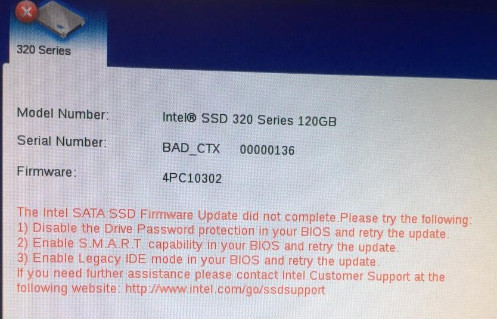
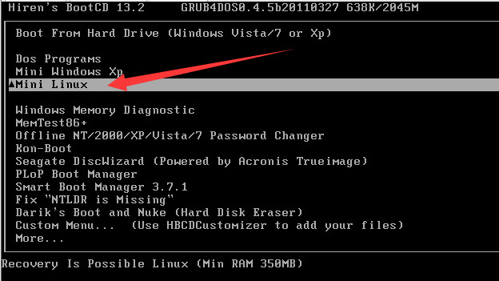
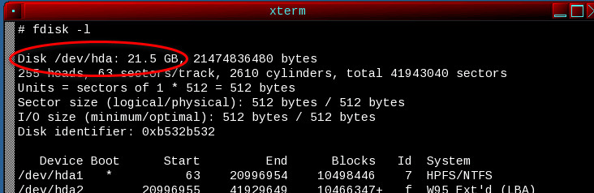
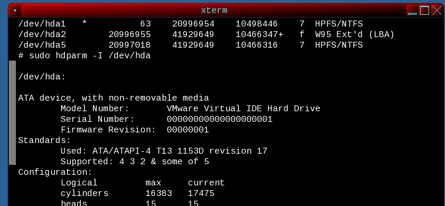
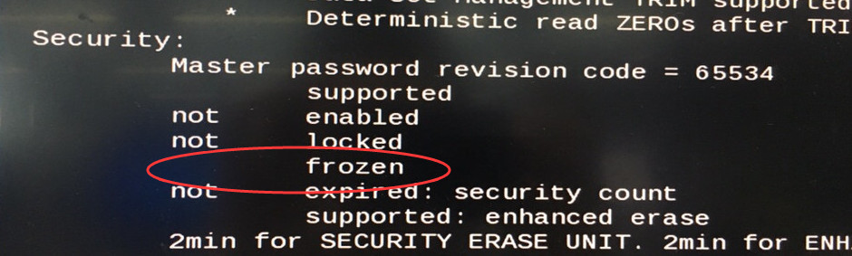
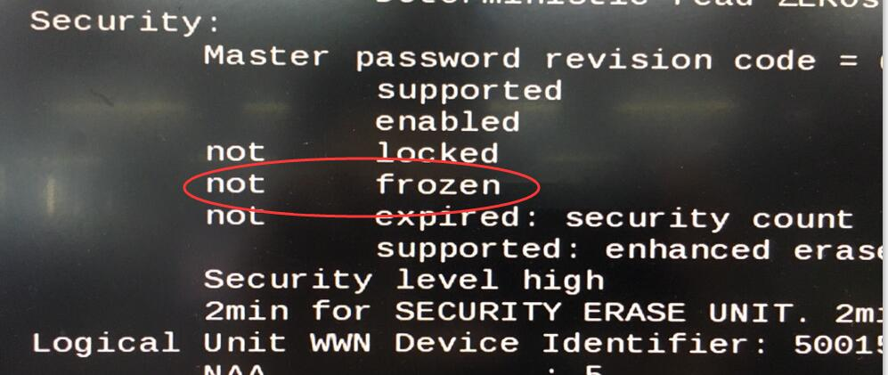
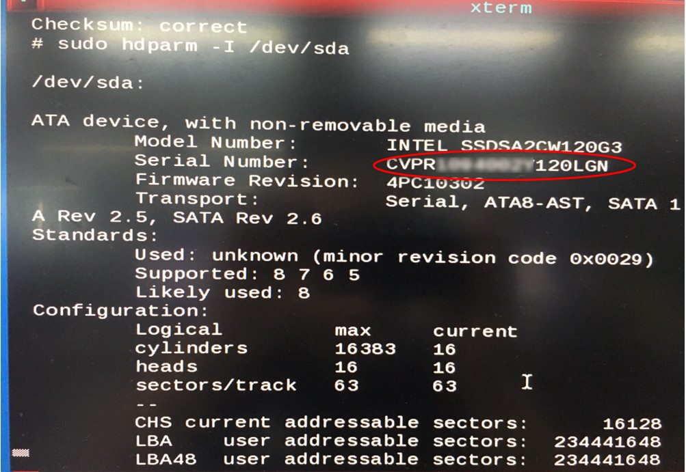

### How to: Fix an unbootable Intel SSD suffering from the 8MB bug

### 修复因特尔固态硬盘显示8MB的问题


Referer url :[https://freek.ws](https://freek.ws/2014/11/12/how-to-fix-an-unbootable-intel-ssd-suffering-from-the-8mb-bug/)


#####  说明

异常断电触发了因特尔固态硬盘的固件bug，硬盘无法使用，显示只有8M.


##### Serial Number BAD_CTX 0000013x

使用官方提供的iso升级，还是失败。




## 解决方法

##### U盘刷Hirens.BootCD.13.2.iso镜像

下载地址  http://www.hirensbootcd.org/files/Hirens.BootCD.13.2.zip

使用[Universal USB Installer](https://www.pendrivelinux.com/universal-usb-installer-easy-as-1-2-3/)刷入到U盘


##### 启动Mini Linux

从U盘启动，选着Mini Linux




##### 打开命令终端

桌面右键，选着xterm


##### 1、显示磁盘列表
显示所有磁盘，找到intel对应的磁盘

```
fdisk –l
```

补充的截图，与实际不一样



##### 2、显示选择的sdX磁盘信息

选择intel硬盘所在的磁盘，显示磁盘信息。往下拉查看Security的状态信息

```
sudo hdparm -I /dev/sdX
```

补充的截图，与实际不一样




##### 3、必须先解除frozen状态



解除方法：拔插stata的电源插头，等待几秒，在重新插入，重复执行命令，查看Security的状态

```
sudo hdparm -I /dev/sdX
```

解除frozen状态成功




##### 4、设置密码

```
 sudo hdparm --user-master u --security-set-pass SOMEPASS /dev/sdX
```
这个密码必须记住，忘记后，硬盘将无法使用


##### 5、安全擦除

硬盘数据将会被格式化，无法恢复数据

```
sudo hdparm --user-master u --security-erase SOMEPASS /dev/sdX
```

执行完毕，第4步设置的密码也会被删除。

再次查看硬盘信息，如果Serial Number显示正常了，那就修复完毕了，硬盘已经可以正常使用了，可以安装系统了。

```
sudo hdparm -I /dev/sdX
```




##### 6、增强删除

重新运行第4步的命令，设置好密码。

```
sudo hdparm -–user-master u –security-erase-enhanced SOMEPASS /dev/sdX
```

再次查看硬盘信息，如果Serial Number显示正常了，那就修复完毕了，硬盘已经可以正常使用了，可以安装系统了。

```
sudo hdparm -I /dev/sdX
```

##### 7、进入windows系统，安装Intel SSD Toolbox，升级因特尔固态硬盘的固件


[Intel SSD Toolbox](https://downloadcenter.intel.com/download/29205?v=t)

[Intel SSD Toolbox- v3.5.12.exe](https://downloadcenter.intel.com/downloads/eula/29205/Intel-Solid-State-Drive-Toolbox?httpDown=https%3A%2F%2Fdownloadmirror.intel.com%2F29205%2Feng%2FIntel%20SSD%20Toolbox-%20v3.5.12.exe)


